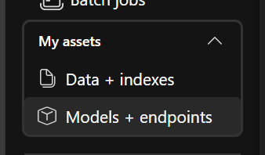
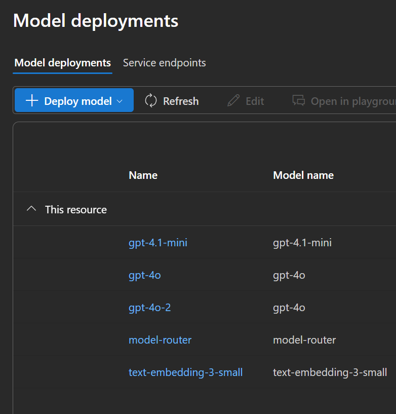
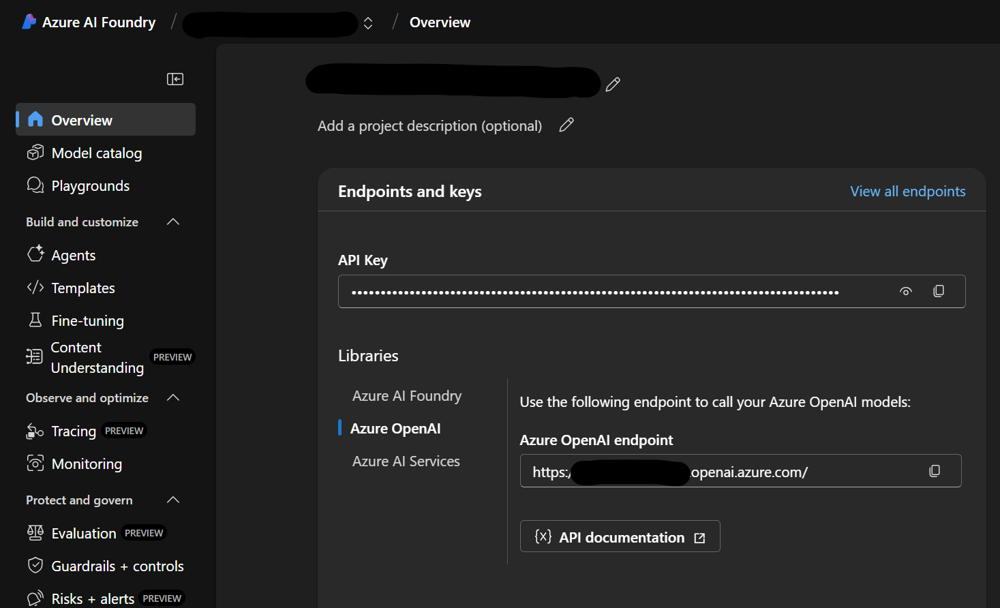

# Agent Framework Hackathon Guide

## Introduction

Welcome to the Agent Framework workshop! This project is designed to help you learn and practice implementing multi-agent systems using Agent Framework. The repository contains a series of progressive exercises that will guide you through building increasingly complex agent systems, from simple single-agent interactions to sophisticated multi-agent collaborative scenarios and MCP servers.

## Setup

### Prerequisites

- GitHub Codespaces
- (or run locally with [Python](https://www.python.org/) 3.9+ installed, see instructions below if needed)
- An Azure OpenAI API key or OpenAI API key (For production ready deployments, you should refrain from using keys, and switch to [managed identities](https://learn.microsoft.com/entra/identity/managed-identities-azure-resources/overview))
- [Visual Studio Code](https://code.visualstudio.com/)


When not using Codespaces, follow below instructions:

### Installation

1. Open Visual Studio Code (Link in your desktop)
2. Open a Powershell terminal using the upper menu `Terminal -> New Terminal` or by pressing CTRL+SHIFT+` (backtick). Make sure to select the Powershell terminal in the dropdown menu on the top right of the terminal window.
3. Clone the repository:

   ```Powershell
   git clone https://github.com/xeniaklimova/agent-framework-workshop
   cd agent-framework-workshop
   ```

4. Select open folder in your VS Code and open the `agent-framework-workshop` folder to see the code in your VS Code.
5. Install depedencies (might take a few minutes):

    [uv](https://github.com/astral-sh/uv) is a fast Python package installer and runner. If you haven't installed it yet:

    ```Powershell
    powershell -ExecutionPolicy ByPass -c "irm https://astral.sh/uv/install.ps1 | iex"
    $env:Path += ";C:\Users\Admin\.local\bin"
    uv sync
    ```

    **OR (without using uv)**

    ```bash
        python -m venv .venv
    ```

    ```powershell
        # On Windows
        .venv\Scripts\activate
    ```

    ```bash
        # On macOS/Linux
        source venv/bin/activate
    ```

    ```powershell
      curl https://bootstrap.pypa.io/get-pip.py -o get-pip.py
      python get-pip.py
      pip --version
    ```

### AI Endpoints Setup

1. Navigate to the Azure Portal `https://portal.azure.com/#home`
2. Login using your credentials
3. Open a new tab in your browser and go to `https://ai.azure.com` (you should be logged in already)
4. Create a new project if none are available.
5. Deploy a GPT-4o model. You can follow the numbered steps in the screenshot below:

- Navigate to `models + endpoints`



- Deploy a new model (gpt-4o for this workshop)



6. Get the API endpoint and key from: 



7. Copy and paste the deployment name, endpoint and API key into a `.env` file. You can find an example in `.env.example`.


```python
# Azure OpenAI configuration
AZURE_OPENAI_ENDPOINT=https://<resource>.openai.azure.com/
# note that cognitiveservices endpoints also work: https://<resource>.cognitiveservices.azure.com/
AZURE_OPENAI_API_KEY=<your-api-key>
AZURE_OPENAI_API_VERSION=2025-03-01-preview
AZURE_OPENAI_CHAT_DEPLOYMENT_NAME=gpt-4o-2024-11-20
AZURE_OPENAI_EMBEDDING_DEPLOYMENT_NAME=text-embedding-ada-002
``` 

---

# Getting Started
Start with the first exercise and progress through them sequentially.

Use documentation on https://learn.microsoft.com/en-us/agent-framework/
to help you with getting up to speed and figuring out what steps to take to complete the exercises.

---


